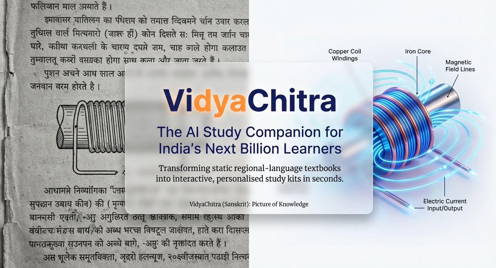

# VidyaChitra — AI Study Companion for Indian School Students



**विद्याचित्र** (VidyaChitra) means "picture of knowledge" in Sanskrit. It is an AI-powered study companion that transforms any NCERT or State Board textbook PDF into a complete, personalised study kit — in the student's own language — within seconds.

---

## The Problem

Over 250 million school students in India study from State Board and NCERT textbooks written in regional languages like Kannada, Hindi, Tamil, Telugu, and Marathi. These students face three major challenges:

1. **Comprehension gap** — Dense textbook language is hard to understand without a teacher's explanation, especially for first-generation learners.
2. **No visual aids** — Diagrams in textbooks are static. Complex science and math concepts — ray diagrams, circuit diagrams, biological processes — are very hard to learn from a flat image alone.
3. **Exam unpreparedness** — Students don't know how questions will be framed in their specific board's pattern (Karnataka SSLC, CBSE, Maharashtra SSC, Tamil Nadu State Board all have different formats).

Most existing EdTech solutions are English-first and ignore regional language students. VidyaChitra is built for India's linguistic diversity from the ground up.

---

## The Solution

VidyaChitra lets a student upload any chapter PDF from their school textbook and instantly receives five personalised study materials, all streamed live as they are generated:

1. **Chapter Summary** — A teacher-style explanation of the entire chapter, written in the textbook's own language, covering every key concept and formula. It appears on screen within seconds of uploading.

2. **Animated Diagram Explainer Video** — An AI-generated short video (15–25 seconds) that animates the most important diagram in the chapter. For example, for a chapter on electromagnetism, the video shows the coil, magnetic field lines, and N/S poles appearing step by step — all labelled in the student's language.

3. **Audio Narration** — A spoken, teacher-style narration of the chapter in the student's regional language, synthesised using Sarvam AI's Bulbul voice (the best-in-class Indian language TTS model). Students can listen while commuting or doing other tasks.

4. **Board-Pattern Exam Questions** — Ten MCQs, three short-answer questions, and one Higher Order Thinking (HOT) question, all framed exactly as they would appear in the student's specific board exam. Questions include explanations and flag concepts that have appeared in previous year papers.

5. **Grounded AI Chat** — A conversational AI tutor that answers any question about the chapter — but only from the chapter's own content, preventing hallucinations. Ask "What is a convex lens?" and it answers from the exact chapter text, citing the relevant concept.

---

## Key Features at a Glance

### Automatic Language and Board Detection
Students do not need to configure anything. VidyaChitra uses Gemini's native PDF understanding to automatically detect which language the textbook is written in, which board it belongs to, and what class level it is. The entire study kit is then generated in that language and board pattern.

### Real-Time Streaming (No Waiting)
Results are streamed live using Server-Sent Events (SSE). The chapter summary appears within 5–10 seconds of uploading. The video, audio, and questions are generated in parallel in the background and pop up on screen the moment each one is ready.

### Side-by-Side PDF Viewer
The original textbook PDF is displayed alongside the generated study materials, so students can read the source while watching explanations. On mobile, tabs switch between the PDF and the study panel.

### Progressive Web App (PWA)
VidyaChitra works in any browser and can be installed on Android phones directly from the browser — no app store required. This makes it accessible on low-cost Android devices common in Indian schools.

### Works Without Internet for Static Assets
Once the study materials are generated, audio and video files are served from local storage (Google Cloud Storage with local file fallback), so they load fast even on slow connections.

---

## Supported Boards and Languages

VidyaChitra supports the four largest State Boards and CBSE, covering six Indian languages:

| Board | Primary Language |
|-------|-----------------|
| Karnataka SSLC | Kannada |
| CBSE Class 10 | Hindi, English |
| Maharashtra SSC | Marathi |
| Tamil Nadu State Board | Tamil |
| Telugu Medium Schools | Telugu |

All generated content — summaries, narrations, video labels, exam questions — is produced in the detected language of the textbook. English is supported for English-medium schools.

---

## How It Works — User Journey

1. **Upload** — The student drags and drops their textbook chapter PDF onto the VidyaChitra web app.
2. **Auto-Detect** — Gemini 2.5 Flash reads the PDF natively (vector text, diagrams, Indic scripts) and identifies the language, board, class level, chapter name, all diagrams, formulas, and key concepts in one pass.
3. **Instant Summary** — The chapter summary is streamed to the screen in the detected language within seconds.
4. **Parallel Generation** — Three AI pipelines run simultaneously in the background:
   - Manim (Python animation library) renders an animated MP4 of the key diagram
   - Sarvam AI synthesises the audio narration
   - Gemini generates board-pattern exam questions
5. **Live Reveal** — Each result appears on screen as soon as it finishes, with smooth fade-in animations and a progress indicator.
6. **Study and Chat** — The student can play the video, listen to the narration, attempt MCQs (with instant feedback and explanations), and ask follow-up questions in the chat panel.

---

## Technology Architecture

VidyaChitra is a full-stack web application with three layers:

### Backend (Python 3.11 + FastAPI)
The backend is a Python FastAPI application that handles PDF ingestion, coordinates all AI calls, and streams results to the frontend. It uses Server-Sent Events (SSE) for real-time streaming, with each generation task running as an independent async task so they complete in parallel without blocking each other.

### AI Pipeline
- **PDF Understanding** — Gemini 2.5 Flash processes the raw PDF bytes natively, reading vector text, embedded fonts (including Kannada, Hindi, Tamil, and Telugu scripts), and visual diagrams in a single API call. This avoids the image-rendering step used by traditional OCR approaches.
- **Video Generation** — Gemini writes a custom Python animation script (Manim scene) tailored to the specific diagram in the chapter. The script is rendered to an MP4 using Manim Community Edition — a professional mathematical animation library. Indic text in the video uses the Nirmala UI font (Windows) or Noto Sans (Linux) for correct Unicode rendering.
- **Audio Narration** — Gemini first writes a spoken-style script in the target language, then Sarvam AI's Bulbul v1 model synthesises it into natural-sounding speech. Sarvam AI is specifically trained on Indian languages and produces significantly more natural output than generic TTS models. If Sarvam is unavailable, Gemini's own TTS model serves as a fallback.
- **Question Generation** — Gemini generates questions that precisely follow each board's marking scheme. For example, Karnataka SSLC questions use the 1-mark, 2-mark, and 4-mark structure with diagram-based questions required for science chapters.
- **Grounded Chat** — Gemini answers questions with the full chapter JSON as context, constrained by a system prompt to only answer from provided content.

### Frontend (React 18 + TypeScript + Vite + TailwindCSS)
A responsive single-page application with a glass-morphism design. It connects to the SSE stream and updates each section — summary, video, audio, questions — independently as events arrive. A custom `useSSEStream` hook manages EventSource lifecycle and prevents race conditions when the server closes the connection after completion.

---

## Innovation Highlights

### One-Call Native PDF Understanding
Instead of rendering each PDF page to an image and making one API call per page (the traditional approach), VidyaChitra passes the entire PDF as raw bytes to Gemini with MIME type `application/pdf`. Gemini reads all pages, diagrams, formulas, and Indic scripts in a single pass — dramatically faster and more accurate, especially for complex scripts like Kannada and Tamil.

### AI-Written Manim Animations
VidyaChitra does not use pre-built animation templates. Gemini writes original Python animation code for every diagram it encounters — ray diagrams, circuit diagrams, biological cell diagrams, geographical maps, flowcharts — and Manim renders them as professional-quality MP4 videos. If the generated code has a rendering error, the error is fed back to Gemini, which corrects and retries automatically.

### Zero Configuration
Students upload a PDF and get results. There are no dropdowns for language, board, or class — Gemini detects all of these automatically from the PDF content. This removes friction for students who may not know the formal name of their board.

### Parallel Streaming Architecture
Using Python's `asyncio` with a task queue, all three generation tasks (video, audio, questions) run simultaneously. The frontend receives each result the moment it is ready, rather than waiting for all tasks to finish. This makes the app feel responsive even though the total generation time can be 60–120 seconds.

---

## Impact and Use Cases

### Primary Audience
Indian school students in Class 6–12 who study from regional-language textbooks and lack access to private tutors or coaching centres.

### Secondary Audience
- **Teachers** — Generate summary and exam questions instantly for lesson planning
- **Parents** — Play the audio narration to children who struggle to read
- **Competitive exam aspirants** — Use board-pattern questions for self-assessment

### Potential Scale
India has over 1.5 million schools. State Board students number over 150 million. VidyaChitra's automatic language detection and board adaptation means the same product works for a student in Bengaluru (Kannada), Mumbai (Marathi), Chennai (Tamil), or Hyderabad (Telugu) without any customisation.

---

## Technology Stack Summary

| Component | Technology |
|-----------|-----------|
| Backend API | Python 3.11, FastAPI, SSE-Starlette |
| AI Model | Google Gemini 2.5 Flash (vision, text, TTS) |
| Indian Language TTS | Sarvam AI Bulbul v1 |
| Video Animation | Manim Community Edition |
| PDF Processing | Gemini native PDF mode + PyMuPDF |
| Storage | Google Cloud Storage (local fallback) |
| Frontend | React 18, TypeScript, Vite, TailwindCSS |
| Mobile Install | Progressive Web App (PWA) |
| Deployment | Docker + docker-compose |

---

## What Makes VidyaChitra Different

| Feature | VidyaChitra | Typical EdTech App |
|---------|-------------|-------------------|
| Indian language support | 6 regional languages | English only |
| Language auto-detection | Yes — no setup needed | Manual selection |
| Animated diagram videos | AI-generated per chapter | Pre-recorded or none |
| Board-specific questions | Karnataka / CBSE / Maharashtra / Tamil Nadu | Generic |
| Works on low-cost Android | Yes (PWA, no app store) | Usually requires app |
| Grounded AI chat | Yes — answers only from chapter | Often hallucinates |
| Real-time streaming | Yes — results appear as generated | Wait for all to finish |

---

## Future Roadmap

- **Offline Mode** — Cache generated materials so students can study without internet
- **More Boards** — Andhra Pradesh, Telangana, West Bengal, Rajasthan State Boards
- **More Languages** — Odia, Punjabi, Gujarati, Bengali
- **Parent Dashboard** — Track which chapters a child has studied and their quiz scores
- **Teacher Tools** — Bulk upload of entire textbook, auto-generate lesson plans
- **Voice Chat** — Speak questions to the AI tutor in regional languages
- **Adaptive Questions** — Difficulty adjusts based on how many previous questions were correct

---

## Quick Start for Developers

Set environment variables:
```
GOOGLE_API_KEY=      # Gemini API key (required)
SARVAM_API_KEY=      # Sarvam AI key (required for Indian language audio)
GOOGLE_CLOUD_BUCKET= # GCS bucket (optional — uses local storage if absent)
```

Run with Docker:
```
docker-compose up --build
```

Run locally:
```
cd backend && pip install -r requirements.txt && uvicorn main:app --port 8080
cd frontend && npm install && npm run dev
```

---

## License

MIT — Free to use, modify, and deploy.

Built for the Indian education ecosystem. Powered by Gemini 2.5 Flash, Sarvam AI, and Manim.
